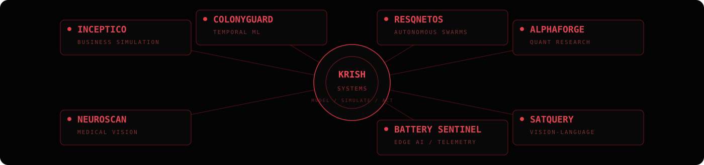

<p align="center">
  
</p>

<p align="center">
  <b>Founder @ Erchomai</b> &nbsp;·&nbsp; Research Consultant @ WorldQuant &nbsp;·&nbsp; AI/ML @ VIT Chennai
</p>

<p align="center">
  I build systems that <b>observe → model → simulate → verify → act</b>.
</p>

---

<p align="center">
  
</p>

### selected systems

**[Inceptico](https://github.com/Mr-McSizzle/studio)** — AI business simulation / decision-support platform  
**[Autonomous Battery Sentinel](https://github.com/Mr-McSizzle/Autonomous-Battery-Sentinel)** — edge AI, telemetry, fault analysis  
**[NeuroScan Edge](https://github.com/Mr-McSizzle/radiology-triage)** — experimental radiology decision-support pipeline  
**[ColonyGuard](https://github.com/Mr-McSizzle/colonyguard)** — temporal ML for iPSC instability monitoring  
**[ResQNetOS](https://github.com/Mr-McSizzle/resqnetOS)** — resilient autonomous drone-swarm infrastructure  
**[AlphaForge](https://github.com/Mr-McSizzle/AlphaForge)** — quantitative research and backtesting infrastructure  
**[SatQuery AI](https://github.com/Mr-McSizzle/satellite-ai)** — agentic vision-language system for remote sensing

---

### current signal

```text
ERCHOMAI      → applied AI / decision systems
WORLDQUANT    → systematic research / alpha modeling
SYSTEMS       → autonomy / simulation / multimodal intelligence
```

### other work

[SatQuery VLM](https://github.com/Mr-McSizzle/vlm) · [SanctuaryOS](https://github.com/Mr-McSizzle/sanctuaryOS) · [RupeeForge](https://github.com/Mr-McSizzle/rupee-forge) · [Pluto](https://github.com/Mr-McSizzle/Pluto)

---

<p align="center">
  <i>Different domains. Same obsession: build intelligence that can survive reality.</i>
</p>

<p align="center">
  <a href="https://www.linkedin.com/in/krishmehan">LinkedIn</a>
  &nbsp;·&nbsp;
  <a href="mailto:krishmehan24@gmail.com">Email</a>
</p>