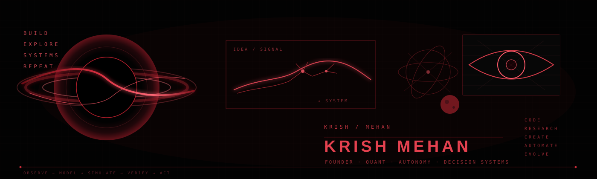

<p align="center">
  
</p>

<p align="center">
  <a href="https://www.linkedin.com/in/krishmehan"></a>
  <a href="mailto:krishmehan24@gmail.com"></a>
  
</p>

```text
$ whoami
Krish Mehan

$ mission
Build systems that reason, simulate, and act under uncertainty.

$ current_focus
Founder @ Erchomai
Research Consultant @ WorldQuant
Applied AI · Quant Research · Autonomous Systems · Simulation
```

## // selected systems

<table>
<tr>
<td width="50%" valign="top">

### [Inceptico](https://github.com/Mr-McSizzle/studio)
**AI-powered business simulation and decision-support platform**
- simulation engine + specialist AI-agent flows
- structured business state + scenario analysis
- full product interface + Firebase-backed services

### [Autonomous Battery Sentinel](https://github.com/Mr-McSizzle/Autonomous-Battery-Sentinel)
**Simulation-first AI telemetry and fault-analysis pipeline**
- CAN telemetry → anomaly detection → degradation forecasting
- edge-deployment experiments + VCU-facing logic
- safety-aware control architecture

### [NeuroScan Edge](https://github.com/Mr-McSizzle/radiology-triage)
**Experimental AI decision-support pipeline for chest X-rays**
- dual-model reasoning, Grad-CAM, TTA, triage layer
- evaluation-first presentation, not fake medical hype

</td>
<td width="50%" valign="top">

### [ColonyGuard](https://github.com/Mr-McSizzle/colonyguard)
**Temporal ML system for iPSC colony instability monitoring**
- morphology + texture features
- longitudinal modeling and instability scoring
- interface snapshots and analysis workflows

### [ResQNetOS](https://github.com/Mr-McSizzle/resqnetOS)
**Resilient autonomous drone-swarm mission infrastructure**
- PX4 + ROS 2 + Gazebo
- modular mission logic + degraded-connectivity thinking

### [AlphaForge](https://github.com/Mr-McSizzle/AlphaForge)
**Quantitative strategy research and backtesting infrastructure**
- research workflow + reproducible experiments
- transaction-cost-aware backtesting + comparison tooling

</td>
</tr>
</table>

## // additional explorations

- [SatQuery AI](https://github.com/Mr-McSizzle/satellite-ai) — agentic vision-language workspace for remote-sensing imagery  
- [SatQuery VLM](https://github.com/Mr-McSizzle/vlm) — multimodal reasoning / LoRA / structured evidence experiments  
- [SanctuaryOS](https://github.com/Mr-McSizzle/sanctuaryOS) — smart-environment command center and automation system  
- [RupeeForge](https://github.com/Mr-McSizzle/rupee-forge) — e-Rupee / UPI / offline-pay fintech prototype  
- [Pluto](https://github.com/Mr-McSizzle/Pluto) — experimental CBDC application architecture  

## // research interests

`agentic systems` · `decision intelligence` · `simulation` · `autonomous systems` · `quant research` · `time-series ML` · `multimodal AI`

## // profile signal

The systems here may look different on the surface — markets, batteries, radiology, cell cultures, drone swarms, business simulation, remote sensing — but they keep circling the same question:

> **How do you build intelligence that can observe a changing system, model it, test decisions, and stay useful when the real world gets messy?**

That question is at the core of how I build.
